# Ledger

A household-finance app for Mendix 11.13.0, authored **entirely through
[mxcli](https://github.com/ako/mxcli) and MDL**. No hand-edited `.mpr`, no Studio
Pro. Every entity, microflow, page and theme token in this repository was written
as MDL source and applied from the command line.

It began as a [Claude artifact prototype](./PROTOTYPE-ANALYSIS.md) and was
rebuilt slice by slice, each one verified by running the app and reading the
figures back out of it.

The second deliverable is [`FINDINGS.md`](./FINDINGS.md) — 134 numbered entries
recording every mxcli bug, surprise and workaround found along the way, with the
exact command and output. Several have since been fixed upstream; the file
records which, and how they were verified.

---

## The app

### Dashboard

One chart. One row per category, and in that row the four things you would
otherwise open four screens to compare.


A net strip across the top — income above the axis, spend below, net through
the middle, every month there is. Then the table: each category's own history
against the band it usually occupies, this year against the same months of last
year as a bar either side of zero, the year's total direct-labelled, and how
much of it is standing cost. Clicking a row lists what is behind it.

The span is counted, never written down. The seed generates fifty-six months
and the caption says fifty-six; it said twenty when the seed generated twenty.
The one place that had the number as a literal was a panel header inside the
chart specification, which cannot count anything — so it no longer names a span
at all, and the caption above it is the single place the figure appears.

The readings are meant to be made in that order and to lead somewhere. A red
dot is a month more than two deviations above that category's own normal:
six of them over 280 category-months, which is about the rate at which a mark
still means "open this". At one deviation it fired on one month in six and was
decoration. The delta bars are coloured by *favourable* rather than by sign, so
income falling and spend rising are both red — Freelance is down € 1,505 on
last year, Rent up € 590. The recurring column is the saving column: a merchant
billing in four months or more is a standing cost, and the filled part of the
bar is the part cancelling actually removes. Income rows are blank there, which
is the honest reading — there is no standing cost to cancel in a salary.

**Uncategorised transactions are a row in the table, not a badge in a corner.**
They get the same four readings as anything else, they sort in with everything
else, and a row cannot be dismissed the way a number off to one side can. Today
that row reads € 764 across twelve transactions, all in one month — which is
why it renders as a point rather than a line.

Clicking a row lists what is behind it, beside the chart — the inspector runs
the height of the whole column, so the list has room rather than five rows and a
pager:

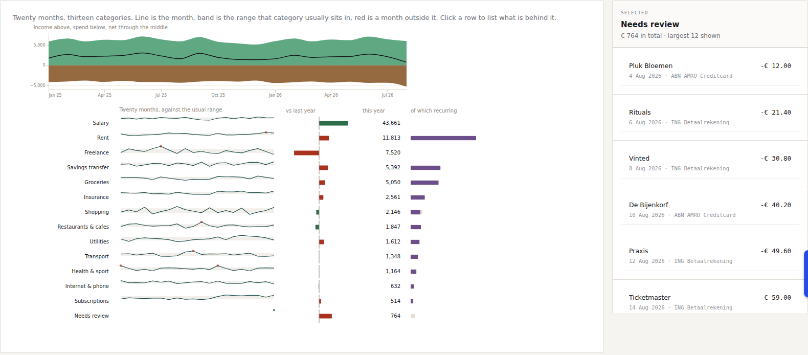

**The review row is the one that had to work.** The dashboard could count twelve
transactions needing review and had no way to show them: every consumer of the
shared transaction view reached rows through an inner join on Category, so a
transaction without one was invisible everywhere except the count complaining
about it. The view now carries them as a second `UNION ALL` branch under the
name 'Needs review', which is the same argument the table already makes for
giving them a row rather than a badge — and it means the list, the click-through
and the detail chart all work on them with no special case. The twelve read back
€ 764.40 against SQL, in the same order.

Any row in either inspector — here or on Cashflow — opens the transaction:

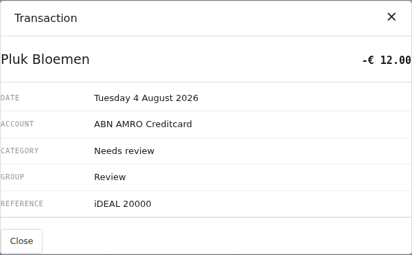

The popup takes the *view row*, not the transaction object, because there is no
route back to the object: a view entity cannot carry an association (CE6771) and
`[id = $Text]` is not a constraint Mendix XPath supports (MDL048). What the view
carries is more than the object has anyway — the category, group and account are
already resolved.

Below both, the same selection as a scatter, against a scale that starts where
the data does rather than at zero, because zero is not a value any grocery shop
ever charged:

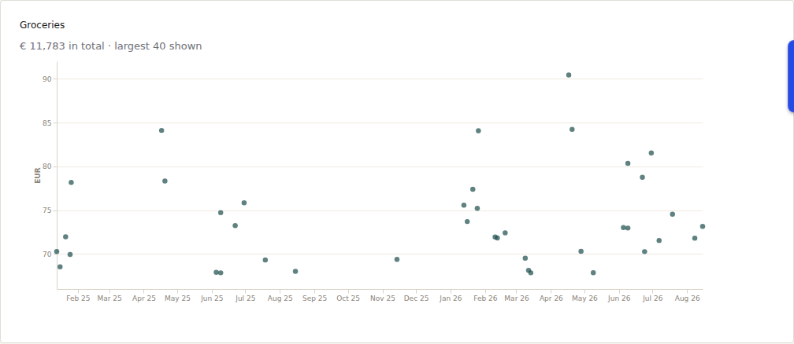

Every figure was read back out of Postgres: Salary € 43,661, Rent € 11,813,
Freelance € 7,520, down to Subscriptions € 514 and the € 764 review row, all
fourteen matching the rendered column exactly. Groceries reports € 11,783 over
220 transactions, largest 40 plotted — also the figure in the panel above.

This replaced a sunburst and a sankey, both Plotly through the CustomChart
escape hatch. Each answered one question and neither answered it densely — a
donut spent a screen on thirteen numbers, a sankey spent one on about twenty,
and both were shape-first: you read the picture, then went hunting for the
figure. Neither showed a trend, an outlier, or anything you could act on.

The replacement is Vega-Lite through the project's own widget, and the whole
table is one spec: an `hconcat` of five faceted panels sharing a row order,
because Vega-Lite cannot put a concatenation *inside* a facet. Even the category
names are a panel — drawn as a text column rather than as facet headers, because
`bounds: "flush"` keeps the row pitch identical across panels and stops the
layout aligning header groups in the same breath, so the labels came out ragged
while every one of them reported `text-anchor="end"` (finding 100). Panels that
must align is the fragile part of the arrangement, and two ways of breaking it
are in finding 94 — facet rows default to sizing themselves to their content, and a
transform that aggregates away the sort field drops one panel back to
alphabetical order while the others hold. Both were found by rendering the spec
headless in node and reading the row geometry off the scenegraph, which turns a
three-minute deploy into a three-second check.

### Cashflow

Thirteen categories by twelve months, with group subtotals and a net line, in
three modes. The heatmap shades each cell by how far it ran over or under its
monthly budget. Clicking a category cell points the inspector at its
transactions.


Variance mode flips the sign for income rows — being *under* on income is the
unfavourable direction:


Months with no data are blank rather than zero. A zero actual against a full
budget would read as maximally under budget and paint the rest of the year
green — see [§5.3 of the analysis](./PROTOTYPE-ANALYSIS.md). "No data" is not
the same as "in the future": bank data arrives in arrears, so the window is the
earlier of months elapsed and months with any activity (finding 83).

The second column is the row's own year: a twelve-month line against a budget
step, the gap between them shaded, and a dot on every month that went the wrong
way. It sits beside the label rather than past December because the matrix
scrolls sideways.

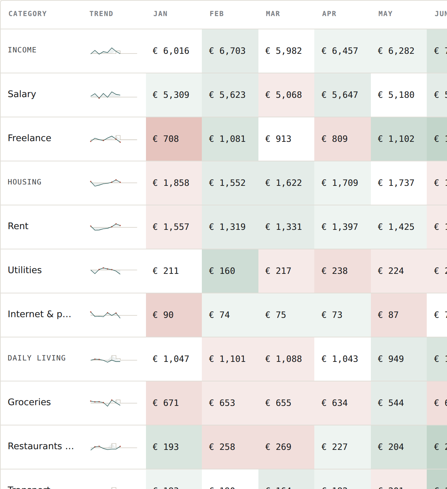

This one is not Plotly. It is Vega-Lite through
[`widgets-src/vegachart`](./widgets-src/vegachart), a pluggable widget built for
this project. The widget takes the **spec and the data separately** — the spec
is a static property, committed and diffable, and the microflow emits only a
table of rows. Nothing assembles a chart payload at runtime, which is the
opposite of how the Plotly charts it replaced were built. `vega-embed`
dispatches on the spec's own `$schema`, so full Vega is reachable through the
same widget for what Vega-Lite cannot express.

The budget is a step, not a curve, so a one-month override reads as what it is:
the raised plateau on Freelance and Groceries is July's override, and the shaded
block under it is the month spent against it.

It follows the mode buttons, because a column of a table is not a chart that
happens to sit beside one. In variance mode the line is the variance itself
against a zero rule; in budget mode it is the plan, stepped, across all twelve
months. Plotting actuals while the cells showed variances drew a line that
contradicted every number on its row.

The rows cost nothing to produce: the builder already has each month's actual
and budget in hand to write the cell beside it, so the sparkline's payload is a
concatenation over figures that were computed anyway. The dot is computed there
too rather than in the spec, because above budget is good news on a salary row
and the spec has no way to know that. That makes the column checkable against
the one next to it — per row, the dots and the red cells agree, 67 and 67.

It began as a separate card below the matrix and vanished for a commit and a
half, because that card was inserted by a later file into a page an earlier file
recreates (finding 103).

Drawing the same numbers more densely is also what exposed finding 83: `€ 0` in
a narrow column had been skimmed past for weeks; thirteen lines diving to the
axis was visible immediately.

### Insights

Six charts, all Vega-Lite through the project's own widget. It opens on the last
two years — 2025 in full and 2026 to date — and the From date reaches back to
2022, which is as far as the seed goes.

**Five of the six read a JSON string the model built. The sixth fetches its own
data**, and the split is not stylistic. The five are aggregates — a month per
category, a day, a merchant — so their payloads stay small however much history
exists. The scatter is deliberately *not* aggregated: it draws one dot per
transaction, which is the whole point of it, so its size is a function of the
database rather than of the taxonomy. It is the only chart here that would
eventually break, and the thing that would break is not the drawing.

Building JSON by concatenation in a microflow costs about 0.4 ms a row once the
string is large — 50,000 rows is roughly twenty seconds before anything is sent,
against 0.6 s to draw the same 50,000 points on a canvas. So the scatter reads a
published OData feed instead, and the reader's filter reaches it as `$filter` on
a URL computed in the model. Measured over five years, three warm samples each
way:

| | attribute | feed |
|---|---|---|
| server microflow | 1,096–1,852 ms | **547–586 ms** |
| click → drawn | 2,939–3,518 ms | **2,253–2,448 ms** |
| page payload | 493 KB | **261 KB** |
| total bytes | **493 KB** | 735 KB |
| marks rendered | 7,891 | 7,891 |

Total bytes went up, and that is the honest cost: OData is more verbose than the
compact JSON the builder emitted, and the two charts that share the URL fetch it
**twice** — Mendix sends no cache headers at all, so the browser has nothing to
revalidate against (finding 127). `$select` naming only the five encoded fields
recovered 41% of it. The server-side win is the one that scales; the byte count
is the one that does not.

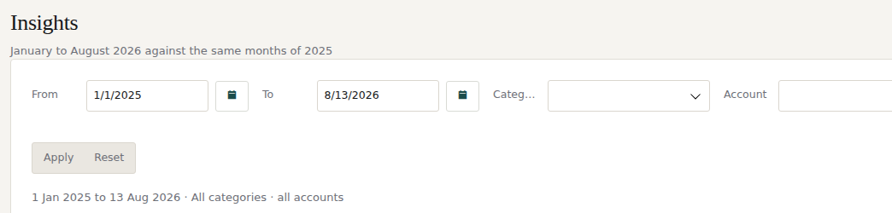

One filter drives all six: a period, a category and an account. The controls
write to the same object the charts read, so applying a change is one microflow
and one `change … refresh` rather than six datasources re-running independently
— which also sidesteps the datasource-refresh problem in finding 68. Filtering
to Groceries takes the scatter from 820 points to 211, matching SQL exactly.

**The filter is applied by the database, not by the model.** Every retrieve on
this page carries its constraint — the period as an XPath range over a
`MonthKey` column the views compute, the category and account as
`($Var = '' or Column = $Var)`, which lets one retrieve serve both the filtered
and the unfiltered case without branching. The page used to pull every row of
five views and discard most of them in a loop, once per chart.

The year-over-year comparison is now a view rather than a microflow. It was the
most expensive flow on the page and the only quadratic one — an outer pass per
category, an inner pass over every row to total it, and a delimited string
standing in for a set. Conditional aggregation does it in one grouped scan, and
the month window it compares over derives from the data itself through nested
scalar subqueries, so nothing has to pass it a boundary. It carries two
aggregation grains in a `UNION ALL` — one row per category, or one per category
per account — because an account filter changes what a row *is*, and a view
takes no parameters; the caller constrains on the grain and the database prunes
the branch it did not ask for before touching a table (finding 97).

One builder kept its grouping, and the reason is the boundary of the technique:
the standing-costs chart counts distinct months *within the selected period*, so
its aggregate depends on a window chosen at runtime. A view can offer a menu of
grains, not a function of one.

The period rounds outward to whole months for the monthly charts and is exact
for the day-level ones, because the aggregate views are grouped by month.

**Income against spend.** Income stacks above the axis, spend below, and the
dark line is the net — where it sits above zero, the month paid for itself.

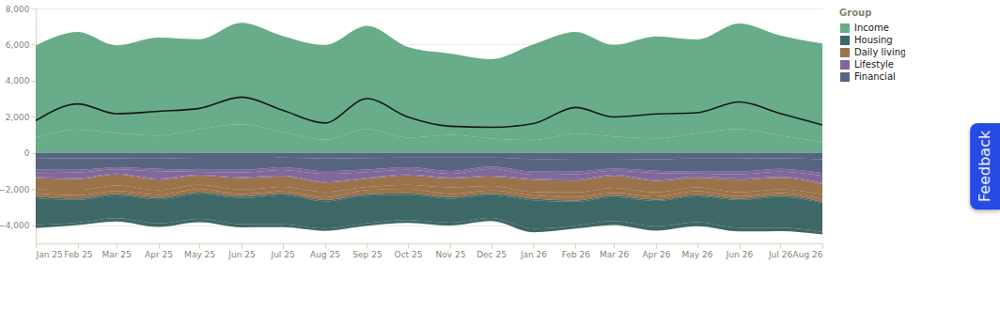

**Every expense, over time**, on a log scale so a € 5 coffee and € 1,500 of rent
can share an axis. The flat band near the top is rent; the one along the bottom
is subscriptions.

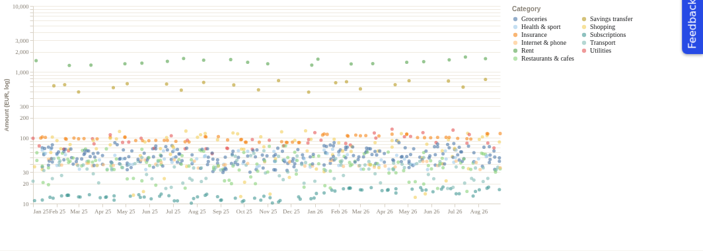

**Spend by day** — a row per year, a column per week, a cell per day. The empty
cells are days nothing was spent at all, which a monthly total cannot show you.

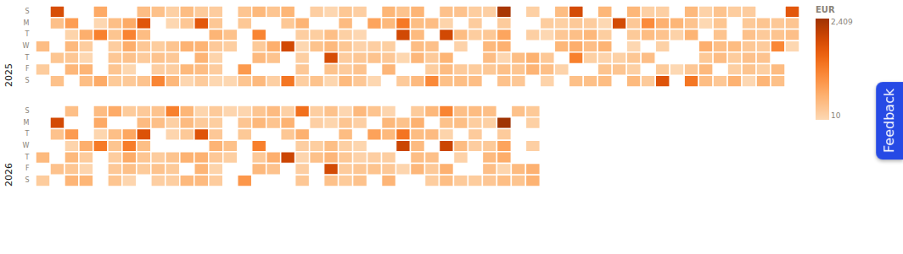

**Standing costs**, ranked by monthly average projected over a year. Merchants
billing in fewer than four months are excluded: a single large purchase is not a
saving opportunity however big it was. Savings transfers are excluded too —
they are booked as expenses everywhere else in this app, correctly, but
cancelling one saves nothing.

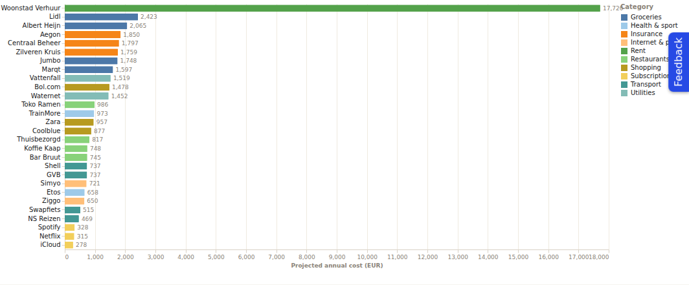

**This year against last**, over the same months of both years so a partial year
is not compared against a whole one. Colour reads favourability rather than
direction, which is not the same thing for income as for spend.

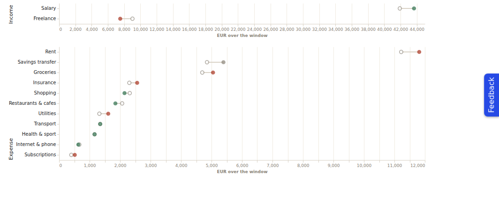

**Transactions unlike the rest of their category** — each compared against its
own category's mean rather than a global one, since € 1,500 is unremarkable for
Rent and extraordinary for Coffee.

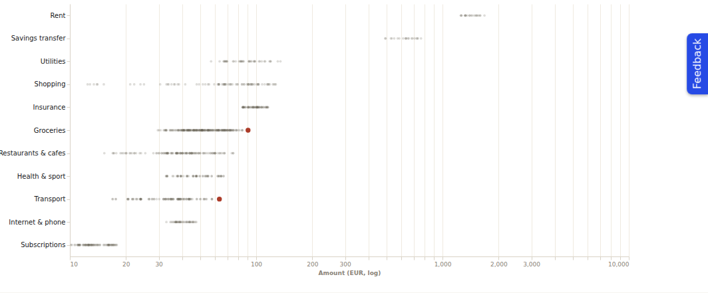

The last two charts read the *same dataset*. The scatter is every expense over
time; the outlier view is the same points with the ones unlike their neighbours
called out, and the calling-out is a `joinaggregate` in the spec — not a second
query, not a second microflow. That is the argument for a grammar over a chart
library, in one line.

#### Two kinds of interaction

The charts respond to a drag and to a click, and the two work in completely
different ways — which is the more interesting half of the story.

**Brushing costs nothing.** Drag across the dates on the scatter and the bars
beneath it re-total to that range:

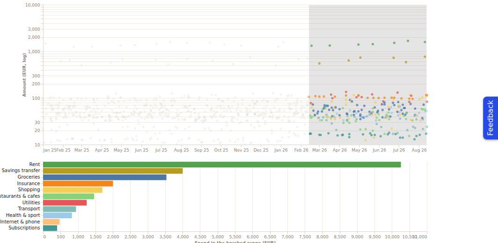

Measured: 568 of 820 points dim, and **zero server calls** during the drag. The
rows are already in the browser, so a range is a `param` and a `filter` — no
query, no microflow, no round trip. Both views have to live in one spec, though:
a Vega-Lite selection is scoped to its own view, so six separate widgets cannot
share a brush without signalling between them by hand.

**Clicking has to leave the browser**, because the answer is not in the payload.
Clicking a calendar day asks which merchants made up that day's total, and the
calendar only carries a date and a sum:

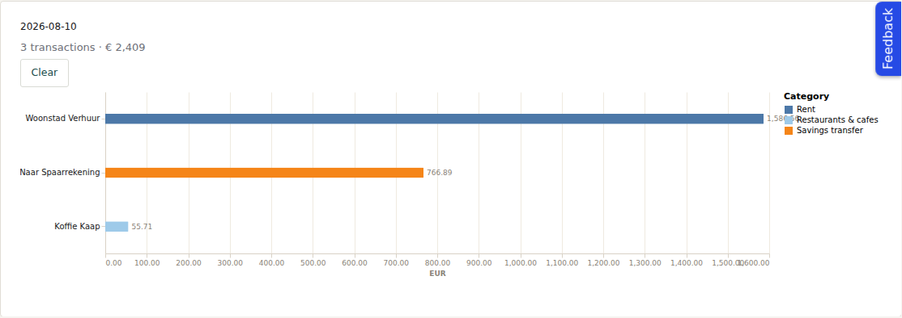

The widget writes the clicked datum as JSON, a microflow reads a field out of it
and builds the panel. 10 August 2026 returns three transactions totalling
€ 2,409.16 — exactly what Postgres reports for that day.

Getting that round trip exact took finding 92: a clicked mark's datum is an
output of the rendering pipeline, not an echo of what was sent. Temporal fields
come back as epoch milliseconds, and an aggregated mark carries only the fields
the spec groups by — so the date has to be carried a second time, as a plain
string the spec references but never parses.

### Budgets

The same matrix, editable, for any year. Click a cell to set that month's
budget; months that override the category baseline are marked.


A stepper above the grid moves the year, and the arrows disappear at the ends
of the range rather than sitting there doing nothing. The range is derived, not
declared — the earliest year with a transaction, through one year past the
latest, so there is always a blank year ahead to budget into. Nothing about
that is a constant, so importing older statements makes older years reachable
without a model change.

Stepping rather than a list of years, for the same reason: a fixed set of
buttons or an enumeration of years would be wrong the first January after it
was written.

The year travels on the row rather than beside it. Both things that act on a
row — rebuilding it after an edit, and opening a cell — are reached from the
grid, where the row is all there is to hold; a cell click that had to be told
the year separately is one page edit away from writing an override into 2026
while the grid shows 2023.

Saving an amount equal to the category baseline **removes** the override rather
than storing a redundant one — an override equal to the baseline would mark the
cell as a deviation when nothing deviated.

### Import

Paste the text of a statement export into the box; rows land in a loader table
first, are checked where they landed, and only the ones that pass are written
into Transactions.

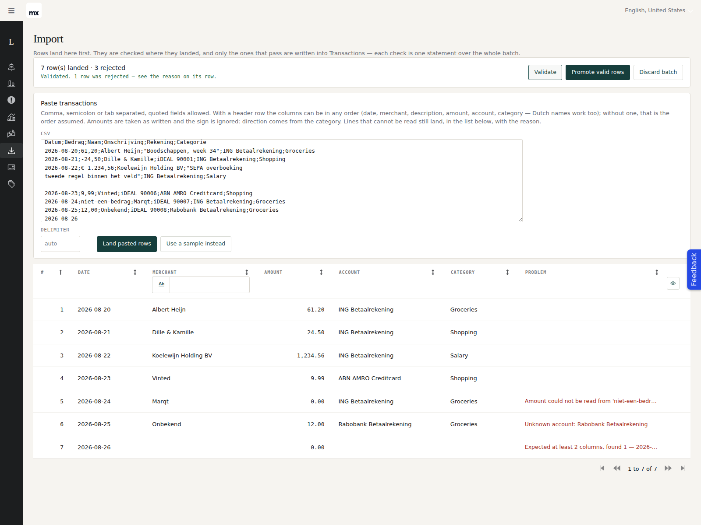

The paste is deliberately forgiving, because what arrives is a clipboard rather
than a contract. The delimiter — comma, semicolon or tab — is detected from the
first line. Quoted fields work, including a field containing the delimiter and a
field containing a **newline**, which is why the parser is a character state
machine and not a split on `\n` followed by a split on `,`. A header row is
detected and its columns mapped by name in any order, in English or Dutch
(`date`/`datum`, `amount`/`bedrag`, `account`/`rekening`); without one the order
is date, merchant, description, amount, account, category. Both decimal
conventions read — `1.234,56` and `1,234.56` both give 1234.56 — and the sign is
discarded, because direction comes from the category everywhere else in this app.

**A line that cannot be parsed still lands.** It arrives flagged, carrying the
reason and the line itself, in the same list as the validation failures. An
import that throws away ninety-nine good rows because the hundredth had a stray
quote is not a loader table, it is a dialog box.

That is also why `ImportRow` carries `HasParseError` as well as `IsValid`.
Validation begins by clearing the problem so that running it twice does not
accumulate reasons; without the flag that reset would erase *"Amount could not be
read from 'niet-een-bedrag'"* and replace it with whichever symptom the checks
happened to notice next — describing the consequence instead of the cause.

Everything after landing is one OQL statement over the whole batch — no retrieve,
no loop, no commit per row. Studio Pro cannot author an OQL statement; these go
through three Java actions written in MDL (`28-oql-dml.mdl`), and the runtime API
they call is two lines.

The parser is Java too (`28a-csv-import.mdl`), for the same reason and no other:
a Mendix microflow expression has no split and no regular expressions, so
tracking whether you are inside a quoted field would be several hundred
activities nobody could read. It resolves nothing and decides nothing — every
field lands as text and the statements below do the rest, because a parser that
started making judgements would be a second place an import could go wrong
quietly.

The validation is set-based too: one `UPDATE` per check, stamping a reason onto
the rows that fail it, each check constrained to rows that are still valid so a
row keeps the *first* reason it failed rather than the last. Rejected rows stay
behind with their reason — which is the whole argument for a loader table over
an import that half-succeeds and reports a number.

**The check that reads naturally is the one that silently passes everything.**
Rejecting rows whose account name did not resolve was written
`where Ledger.ImportRow_Account = null`, which matches no rows at all, in either
spelling, with no error: the bad row was promoted with no account and the screen
reported clean input. `not exists` against the source table finds it (finding
111).

Statements do not pass through the object cache, so nothing they change reaches
a client on its own. The grid above refreshes because each action ends by
committing the screen's context object with **refresh**, and the grid reads
through a constraint on that object.

The same actions put a **Copy a year** panel on Budgets: a year of overrides
copied with `insert … select`, idempotent because the target year is cleared
first in the same transaction.

### Categories & rules

Ordered categorisation rules, first match wins, over transactions that have no
category yet. A rule never overwrites a category assigned by hand.


The panel says what a run *would* do before it does it, using the same evaluation
the run uses. `Categorised` is derived from the data after every run rather than
incremented, so it cannot drift.

### Transactions


The list you work in: search per column, sortable headers, paging, and a row
that opens for editing. It had none of that at first — 932 rows with no way to
act on the twelve the dashboard said needed review.

Dates and amounts render through **dynamic-text columns** — `ShowContentAs:
dynamicText` with a per-parameter `format (…)` block — rather than plain
attribute columns, which have no formatting options and would show `-21.4` and
the browser's locale date. A column can do both: naming the attribute as well
keeps it sortable and filterable while the display stays formatted. This is the
one screen that does not preformat in a microflow; the capability came from
mxcli PR #88, prompted by findings 75–78.

Saving goes through a microflow rather than the built-in Save, because the
direction of an amount follows its category: `Amount` is always positive and
`SignedAmount` carries the sign, so filing an uncategorised row — seeded
negative, since nearly all of them are spend — under Salary has to flip it. The
same microflow now runs when the rules engine assigns a category, which had the
same gap.

Getting the columns to render at all took three findings' worth of silence:
`Size` is a ratio that only applies alongside `ColumnWidth: manual` and builds
an invalid column without it (107), a `filter` block at grid level is accepted
and then discarded (108), and the file that owns this page had been unparseable
for weeks behind a doc comment left without a statement (106).

---

## How it is built

MDL source lives in [`Ledger/mdlsource/`](./Ledger/mdlsource), numbered so the
files apply in dependency order:

| Files | Slice |
|---|---|
| `01`–`04` | Domain model, enumerations, demo data — five years, 2022 to date |
| `05` | Transactions, Accounts, Categories screens |
| `06`–`11` | Cashflow matrix, shared views, sparkline column, inspector, transaction popup |
| `12`–`16` | Budgets, per-cell overrides, the year stepper |
| `17`–`19` | Rules engine |
| `21b`–`22` | Dashboard: the overview table and what is behind a row |
| `24`, `24a`, `25`–`26` | Insights: aggregate views (including the two-grain year-over-year), the published feed the scatter fetches, payloads, six charts |
| `27` | Navigation — the single owner of the menu, applied last |
| `28` | OQL statements: bulk insert/update/delete through Java actions |
| `28a` | The CSV parser behind the paste box on Import |
| `29` | The Import screen, and the copy-a-year panel on Budgets |

`16` binds the copy panel to two microflows that `29` defines, so a genuinely
from-scratch build needs `29` applied before it — `mxcli check --references`
reports `microflow not found` otherwise. Re-applying the whole set over an
existing `.mpr` is unaffected, which is why it has not bitten. The panel is
authored in `16` rather than inserted by `29` because an `ALTER PAGE INSERT`
from a later file is silently wiped the next time the owning file runs
(finding 103), and a quiet failure is the worse of the two.

A runtime monitoring pass — what the app actually does under load, and the four
N+1 datasources it found and fixed (2,194 SELECTs per pass down to 173) — is in
[`docs/observability.md`](./docs/observability.md).

Drilldowns are keyed on `cast(id as string)` rather than on display names. A
view entity cannot carry an association, but it can expose an id, and a view
constrained on that column returns exactly what an association join returns —
so the cashflow inspector reaches its rows without ever holding the object. See
finding 74.

The set is **re-applied from scratch** rather than patched, so the numbering is
the build order and every file is idempotent (`create or modify` throughout).

```bash
cd Ledger
mxcli widget init -p Ledger.mpr                          # required first — see below
for f in mdlsource/*.mdl; do mxcli exec "$f" -p Ledger.mpr; done
~/.mxcli/mxbuild/11.13.0/modeler/mx check Ledger.mpr     # the authority
mxcli test tests/ -p Ledger.mpr --local                  # 38 unit tests
mxcli run --local --ensure-db                            # run it
```

**Not while the app is running.** The test runner rebuilds the deployment
folder underneath a live app (finding 93) and strips the browser bundle on the
way out — it says so, and `mxcli run --local` puts it back.

It also leaves `Ledger.mpr` byte-modified even though it reports the project
restored — the model is restored, the file is not (finding 125). Run the tests
before staging and discard the file afterwards.

### What is and is not tested

One suite, `tests/csv-import.test.mdl`, over the CSV parser: 38 tests, 512 ms.
Delimiter detection, quoting, header mapping in two languages, six ways of
writing an amount, and the rows that fail to parse.

That is the whole of it, and the reason is worth being plain about. The parser
is the only substantial piece of this app that takes a value and returns a
value. Everything else reads the database, writes it, or draws it, and a unit
test over those either seeds a fixture and then tests the fixture, or needs a
browser. The rest of the project is verified the way the rest of this README
describes — figures read back out of Postgres, and screenshots.

The suite was checked against deliberate breakage rather than trusted because it
was green. Inverting the "last separator wins" rule failed three tests, as it
should. Removing the `abs()` on parsed amounts failed **none** — which was the
useful result: the character filter drops the minus sign long before `abs()` is
reached, so that line is unreachable and the test named "a negative amount lands
positive" is really exercising the filter. The code now says so.

One case is untestable rather than untested: a tab inside an MDL string is
stored as backslash-t and never reaches the runtime (finding 122), so the
tab-delimited fixture cannot be written at all. That path is verified in the
browser instead, where a paste carries real tabs.

Three rules learned the hard way and worth stating up front:

- **`mxcli check` is a syntax and reference gate; `mx check` is the authority.**
  Several defects in `FINDINGS.md` pass the first and fail the second, and a
  couple pass both and only show up at runtime. It also runs the other way: as of
  mxcli `0bf0f0ea`, `mxcli check` reports three "Unexpected token after
  expression" errors — two in `25-insights-data.mdl`, one in `28-oql-dml.mdl` —
  that are false. Its expression lexer does not know the `''` apostrophe escape
  (`FINDINGS` 131); `mx check` reports 0 errors and the unit suite covers the
  expressions in question. The findings carry no file or line, so they are easy
  to mistake for something real.
- **`DESCRIBE` is how you find out what was actually serialized.** More than one
  finding came from comparing authored MDL against what came back.
- **`mxcli widget init` is a build step, not a setup step.** mxcli writes a
  widget instance from a definition cached under `Ledger/.mxcli/`, which is
  gitignored and does not refresh when a `.mpk` changes. Skip it after a package
  upgrade and every Data Grid 2 the set authors describes a widget that no
  longer exists — six CE0463 errors, with nothing before `mx check` to say so.
  See finding 87.

### Toolchain

[`scripts/setup-tools.sh`](./scripts/setup-tools.sh) builds mxcli from source,
pins ANTLR, and pre-caches the Mendix engine and runtime. It is idempotent and
detect-then-install, so it is safe on every session start — cold 1m42s, warm
1.4s. [`TOOLING.md`](./TOOLING.md) documents the environment and the ground
rules.

### Theme

The prototype's design system — warm paper, flat hair-ruled cards, a dark
sidebar, IBM Plex, monospace figures — is reproduced by overriding **Atlas'
own custom properties** in `Ledger/theme/web/custom-variables.scss` rather than
by restyling widgets. Every control stays a stock Atlas control and keeps its
states, focus rings and dark-mode handling. Only the handful of things Atlas has
no token for live in `Ledger/themesource/ledger/web/main.scss`.

Monospace on every number is the largest single fidelity win, and it is not
decoration: a fourteen-column matrix of currency only scans if the digits line
up.

The sidebar collapses to a 52px icon rail and opens to the prototype's 224px:

| collapsed | open |
|---|---|
| 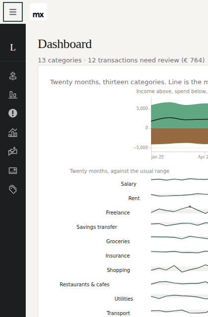 | 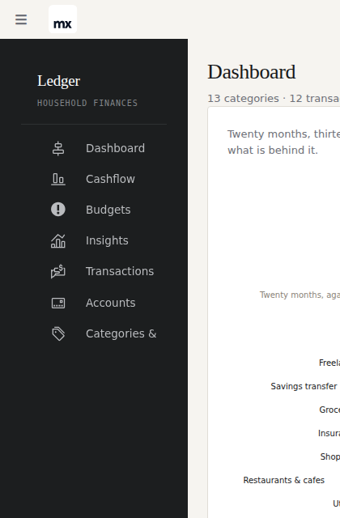 |

It did not, for a while, and the reason is a good illustration of what token
overrides cost: the closed width had been pinned to the open one back when the
menu had no icons, and once icons arrived Atlas' own rule — which gives the
glyph `flex-basis: var(--closed-sidebar-width)` — turned that into a 224px icon
slot that pushed every caption out of view. Finding 95 has the measurements.

### Three themes, switched at runtime

`mxcli theme` installs a switchable set: **Ledger Paper** (the palette above),
**ING** and **Rabobank**. All three compile into one stylesheet and selecting
one is a class swap on `<html>` — no rebuild, no reload, no server round trip.

| Ledger Paper | ING | Rabobank |
|---|---|---|
| teal `#1B4D4B`, warm paper, charcoal rail | orange `#FF6200`, charcoal rail | blue `#000099`, **blue** rail, orange active mark |

ING and Rabobank are `mxcli theme create` scaffolds living in
`Ledger/theme/mxcli-themes/`, committed with the project. The colours
approximate each bank's public brand; they are demonstration themes, not
official assets.

**The interesting part is what made the app's own CSS follow.** The 29KB of
hand-written component styling reads 17 `--ledger-*` tokens in 72 places, all
literal hex — so a theme swap moved the Atlas widgets and left the cashflow
matrix, the sidebar and the import table exactly as they were. Half a re-brand.
Redefining those tokens as `var(--mxt-…)` fixes it in nineteen lines, because
custom properties resolve at *use* time and pick up whichever theme is scoped on
`:root`. One alias layer, and one class swap moves everything.

The three buttons sit under each page title rather than in the topbar, and that
is a toolchain limit rather than a choice: **layouts are the one document MDL
cannot author** (`mxcli` says so outright when you describe one), so nothing can
be added beside the language selector. Finding 136.

Note that the charts do not re-theme. Their palettes are baked into the Vega
specifications as literal hex, which is the right call for a chart — a spec that
resolved its colours from CSS would render differently depending on where it was
embedded — but it does mean the largest area of colour on the Dashboard is the
one thing a theme does not touch.

### Seven languages

English, Dutch, German, French, Czech, Spanish and Italian, enabled with
`alter settings LANGUAGE add` and switched from the selector Atlas puts in the
topbar. 129 source strings are translated from a single table keyed on the
English text, so every language says the same thing and a wording change is one
edit rather than seven — `Ledger/mdlsource/31-translations-*.mdl` are generated
from it.

This is Ledger's own UI, not a complete localisation: placeholders, symbols,
seeded merchant names and the Atlas strings Mendix already ships are left alone,
and anything untranslated falls back to en_US. `CheckCompleteness` is off for
that reason.

One trap worth repeating from finding 137: scoping the translations `IN Ledger`
looks careful and silently misses the navigation menu, because navigation is a
project-level document. The symptom is a page whose text is German above a
sidebar that is still English.

---

## Known gaps

Stated rather than hidden:

- **Three of the seven menu icons are not the ones Studio Pro had.** MDL's
  `ICON` reaches icon-collection icons only; the Accounts item carried a glyph
  icon and Categories & rules an image icon, neither of which is authorable.
  Both were placeholders, so file 27 authors collection icons in their place
  and the whole set is reproducible again. `DESCRIBE` now names what it cannot
  carry instead of dropping it silently — see finding 81, which is how the icons
  came to be understood at all. The third, Transactions, was carried faithfully
  and still had to be replaced: it pointed at `Atlas_Styling`, a collection
  whose CSS prefix Atlas' own navigation rules do not match — see finding 95.
- **The chart itself is not clickable.** Three independent blockers, all recorded
  in `FINDINGS.md` 67–69: MDL silently drops an `action`-typed property on a
  pluggable widget; writing a widget attribute does not re-run a datasource over
  its object; and CustomChart forwards the clicked segment's *bounding box*
  rather than the point. The drilldown works through the breakdown list beside
  the chart instead.
- **The dashboard breakdown pages at 20 rows.** `PageSize` on the listview did
  not take effect, so deeper groups need paging to reach.
- **CSV import is not built.** The prototype's import wizard read no file and its
  counts were hardcoded; a real one is genuinely new work.
- **The theme pulls IBM Plex from Google Fonts at runtime.** Where that CDN is
  unreachable the app silently falls back to system faces — including in the
  container these screenshots were taken in, so the images above do not show the
  intended typography. Self-hosting the faces would fix both.

## Layout

```
FINDINGS.md              134 numbered findings — the main deliverable alongside the app
PROTOTYPE-ANALYSIS.md    what the prototype did, what was real, what was decided
TOOLING.md               environment, ground rules, tool versions
docs/observability.md    runtime monitoring pass — errors, DB pressure, hot flows
docs/widget-recovery.md  open work order — restoring the widget packages
scripts/setup-tools.sh   idempotent toolchain build
Ledger/mdlsource/        all MDL source, numbered in dependency order
widgets-src/vegachart/   the project's own pluggable widget (Vega-Lite / Vega)
Ledger/tests/            unit tests over the CSV parser (mxcli test --local)
Ledger/theme/            Atlas token overrides
Ledger/themesource/      component styling
docs/screenshots/        the images above
```
