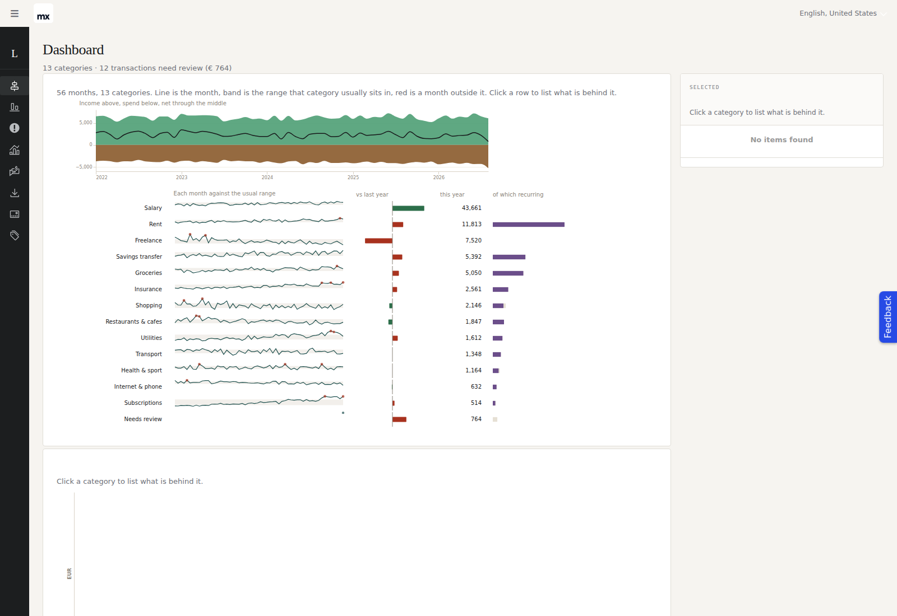
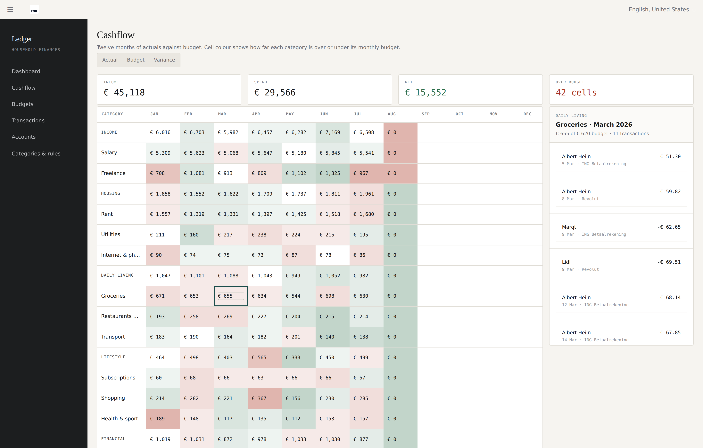
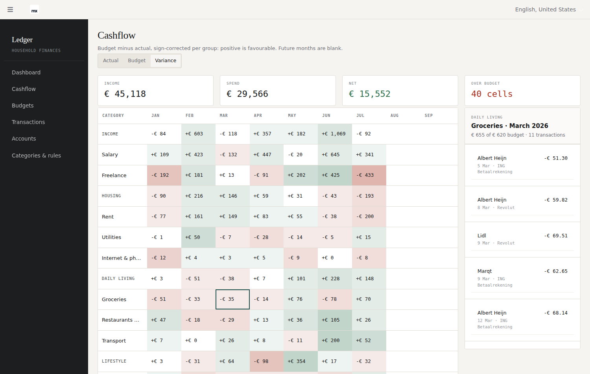
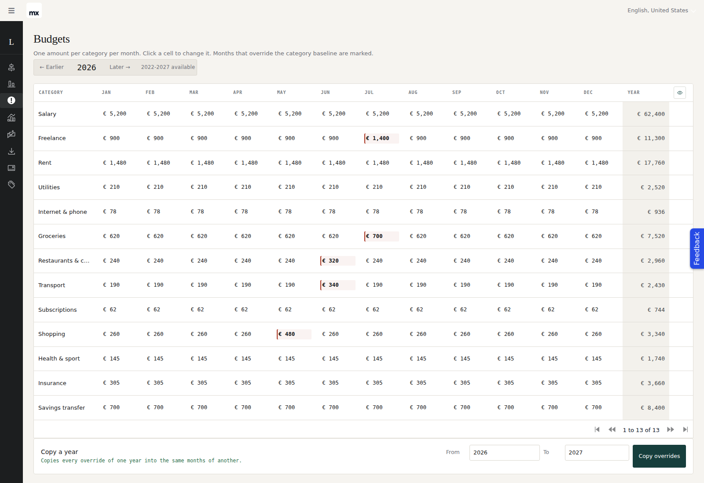
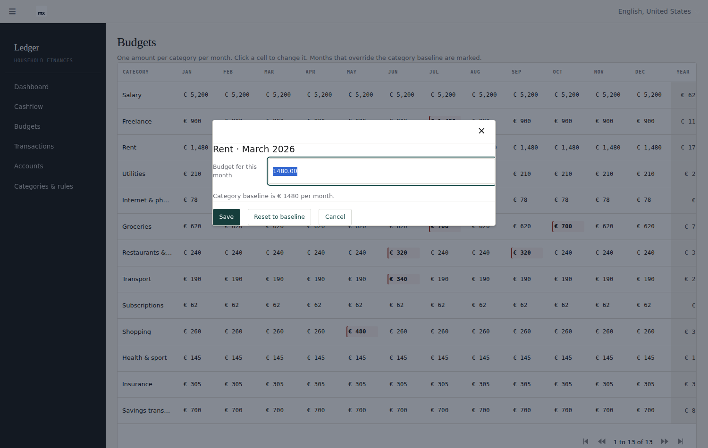
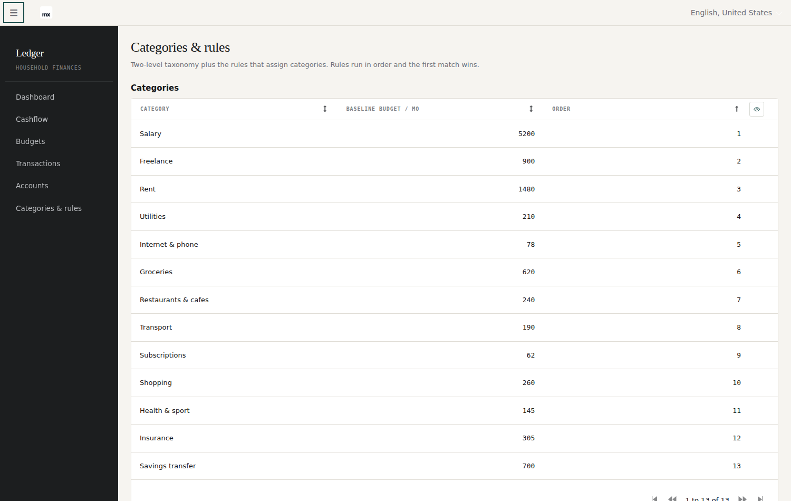
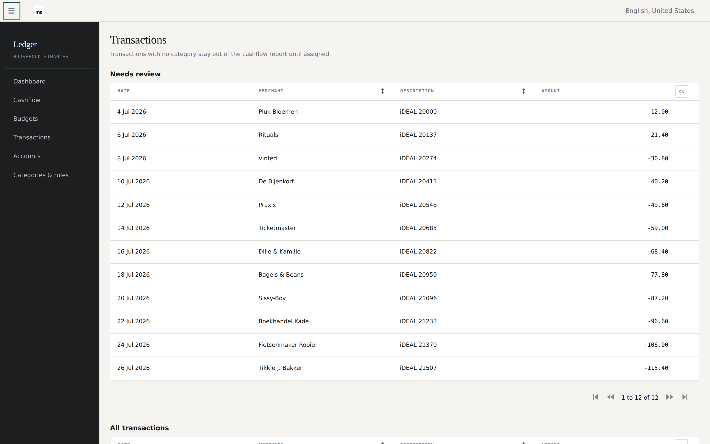

# Ledger

A household-finance app for Mendix 11.12.1, authored **entirely through
[mxcli](https://github.com/ako/mxcli) and MDL**. No hand-edited `.mpr`, no Studio
Pro. Every entity, microflow, page and theme token in this repository was written
as MDL source and applied from the command line.

It began as a [Claude artifact prototype](./PROTOTYPE-ANALYSIS.md) and was
rebuilt slice by slice, each one verified by running the app and reading the
figures back out of it.

The second deliverable is [`FINDINGS.md`](./FINDINGS.md) — 73 numbered entries
recording every mxcli bug, surprise and workaround found along the way, with the
exact command and output. Several have since been fixed upstream; the file
records which, and how they were verified.

---

## The app

### Dashboard

Spend for the year as a three-level donut — category group, category, merchant —
over a single OQL view aggregated per merchant and rolled up in memory. Clicking
any level of the breakdown lists the transactions behind it.



The total, **€ 29,566**, is computed here from the merchant view. The Cashflow
screen arrives at the same number from an entirely different query, and Groceries
comes to € 4,484 on both. That agreement is the test.

### Cashflow

Thirteen categories by twelve months, with group subtotals and a net line, in
three modes. The heatmap shades each cell by how far it ran over or under its
monthly budget. Clicking a category cell points the inspector at its
transactions.



Variance mode flips the sign for income rows — being *under* on income is the
unfavourable direction:



Months that have not happened yet are blank rather than zero. A zero actual
against a full budget would read as maximally under budget and paint the second
half of the year green — see [§5.3 of the analysis](./PROTOTYPE-ANALYSIS.md).

### Budgets

The same matrix, editable. Click a cell to set that month's budget; months that
override the category baseline are marked.





Saving an amount equal to the category baseline **removes** the override rather
than storing a redundant one — an override equal to the baseline would mark the
cell as a deviation when nothing deviated.

### Categories & rules

Ordered categorisation rules, first match wins, over transactions that have no
category yet. A rule never overwrites a category assigned by hand.



The panel says what a run *would* do before it does it, using the same evaluation
the run uses. `Categorised` is derived from the data after every run rather than
incremented, so it cannot drift.

### Transactions



---

## How it is built

MDL source lives in [`Ledger/mdlsource/`](./Ledger/mdlsource), numbered so the
files apply in dependency order:

| Files | Slice |
|---|---|
| `01`–`04` | Domain model, enumerations, demo data |
| `05` | Transactions, Accounts, Categories screens |
| `06`–`11` | Cashflow matrix, view entities, inspector |
| `12`–`16` | Budgets, per-cell overrides |
| `17`–`19` | Rules engine |
| `20`–`22` | Dashboard sunburst |

A runtime monitoring pass — what the app actually does under load, and the
four N+1 datasources it found and fixed (2,194 SELECTs per pass down to 225) —
is in [`docs/observability.md`](./docs/observability.md).

The set is **re-applied from scratch** rather than patched, so the numbering is
the build order and every file is idempotent (`create or modify` throughout).

```bash
cd Ledger
for f in mdlsource/*.mdl; do mxcli exec "$f" -p Ledger.mpr; done
~/.mxcli/mxbuild/11.12.1/modeler/mx check Ledger.mpr     # the authority
mxcli run --local --ensure-db                            # run it
```

Two rules learned the hard way and worth stating up front:

- **`mxcli check` is a syntax and reference gate; `mx check` is the authority.**
  Several defects in `FINDINGS.md` pass the first and fail the second, and a
  couple pass both and only show up at runtime.
- **`DESCRIBE` is how you find out what was actually serialized.** More than one
  finding came from comparing authored MDL against what came back.

### Toolchain

[`scripts/setup-tools.sh`](./scripts/setup-tools.sh) builds mxcli from source,
pins ANTLR, and pre-caches the Mendix engine and runtime. It is idempotent and
detect-then-install, so it is safe on every session start — cold 1m42s, warm
1.4s. [`TOOLING.md`](./TOOLING.md) documents the environment and the ground
rules.

### Theme

The prototype's design system — warm paper, flat hair-ruled cards, a dark
sidebar, IBM Plex, monospace figures — is reproduced by overriding **Atlas'
own custom properties** in `Ledger/theme/web/custom-variables.scss` rather than
by restyling widgets. Every control stays a stock Atlas control and keeps its
states, focus rings and dark-mode handling. Only the handful of things Atlas has
no token for live in `Ledger/themesource/ledger/web/main.scss`.

Monospace on every number is the largest single fidelity win, and it is not
decoration: a fourteen-column matrix of currency only scans if the digits line
up.

---

## Known gaps

Stated rather than hidden:

- **The chart itself is not clickable.** Three independent blockers, all recorded
  in `FINDINGS.md` 67–69: MDL silently drops an `action`-typed property on a
  pluggable widget; writing a widget attribute does not re-run a datasource over
  its object; and CustomChart forwards the clicked segment's *bounding box*
  rather than the point. The drilldown works through the breakdown list beside
  the chart instead.
- **The dashboard breakdown pages at 20 rows.** `PageSize` on the listview did
  not take effect, so deeper groups need paging to reach.
- **The Transactions screen shows raw decimals** (`-21.4`). MDL has no number or
  date format on a grid column; the other screens work around it by preformatting
  in the builder, and this one has not been converted.
- **CSV import is not built.** The prototype's import wizard read no file and its
  counts were hardcoded; a real one is genuinely new work.
- **The theme pulls IBM Plex from Google Fonts at runtime.** Where that CDN is
  unreachable the app silently falls back to system faces — including in the
  container these screenshots were taken in, so the images above do not show the
  intended typography. Self-hosting the faces would fix both.

## Layout

```
FINDINGS.md              73 numbered findings — the main deliverable alongside the app
PROTOTYPE-ANALYSIS.md    what the prototype did, what was real, what was decided
TOOLING.md               environment, ground rules, tool versions
docs/observability.md    runtime monitoring pass — errors, DB pressure, hot flows
scripts/setup-tools.sh   idempotent toolchain build
Ledger/mdlsource/        all MDL source, numbered in dependency order
Ledger/theme/            Atlas token overrides
Ledger/themesource/      component styling
docs/screenshots/        the images above
```
